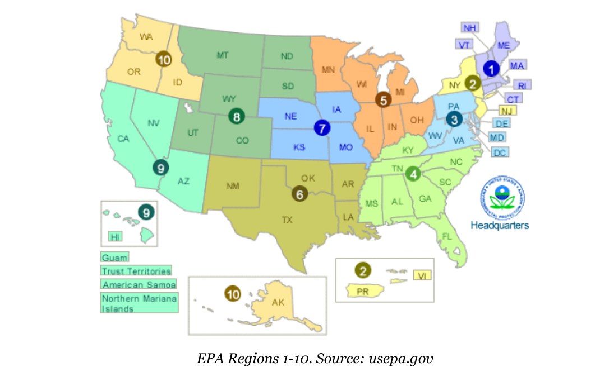

<style type="text/css">
h1.title {
  font-size: 20px;
</style>


```{r global_options, include=FALSE}
knitr::opts_chunk$set(echo=FALSE, warning=FALSE, message=FALSE, fig.width = 6, fig.height = 3)
library(knitr)
library(kableExtra)
library(ggplot2)
library(broom)
library(gmodels)
```

Philadelphia is served by a combined sewer system and is currently considering efforts to improve it's sewer system in a manner that will provide environmental and economic benefit to the city. We will look at the environmental and population data from different cities and facilities in the US and hopefully glean some useful information that we can use to guide Philadelphia's decision.  

Throughout this report, we will be relying on official data from the EPA and the US census office. Because there are many facilities, most of the analysis will be done in regional chunks for ease of analysis and representation. The EPA Regions are labelled from 1-10 and are indicated below:  


```{r input_data}
sewer_data <- read.csv("cwns2012.csv")

# using regex to prevent other cities that may have philadelphia in name
philly_sewer_data <- sewer_data[grep("^(philadelphia)", sewer_data$FACILITY_CITY, ignore.case = TRUE),]

# remove philadelphia(s) that are not in PA
philly_sewer_data <- subset(philly_sewer_data, STATE == "PA")

# convert the EPA_REGION to factor since it is intially read as a numeric character
sewer_data$EPA_REGION <- as.factor(sewer_data$EPA_REGION)
sewer_data$MS4 <- as.factor((sewer_data$MS4))
```
### **Section 1: Summary Statistics and visual plots **
```{r differences_and_percent_changes}

### **Section 1: Computing projected changes**
# calculate difference in changes and percent differences 
sewer_data$proj_change_res_rec_collctn <-sewer_data$PROJ_RES_REC_COLLCTN - sewer_data$PRES_RES_REC_COLLCTN
sewer_data$perc_proj_change_res_collctn <- sewer_data$proj_change_res_rec_collctn / sewer_data$PRES_RES_REC_COLLCTN * 100
sewer_data$proj_chang_res_rec_trmt <- sewer_data$PROJ_RES_REC_TRMT - sewer_data$PRES_RES_REC_TRMT
sewer_data$per_proj_change_res_rec_trmt <- sewer_data$proj_chang_res_rec_trmt / sewer_data$PRES_RES_REC_TRMT * 100
sewer_data$proj_chang_n_res_rec_trmt <- sewer_data$PROJ_N_RES_REC_TRMT - sewer_data$PRES_N_RES_REC_TRTM
sewer_data$perc_proj_chang_n_res_rec_trmt <- sewer_data$proj_chang_n_res_rec_trmt /  sewer_data$PRES_N_RES_REC_COLLCTN * 100
sewer_data$proj_change_n_res_rec_collctn <-sewer_data$PROJ_N_RES_REC_COLLCTN - sewer_data$PRES_N_RES_REC_COLLCTN
sewer_data$perc_proj_change_n_res_rec_collctn <- sewer_data$proj_change_n_res_rec_collctn / sewer_data$PRES_N_RES_REC_COLLCTN * 100

#calculate population densities
sewer_data$pop80_density <- sewer_data$POP80 /  sewer_data$ALAND
sewer_data$pop90_density <- sewer_data$POP90 / sewer_data$ALAND
sewer_data$pop00_density <- sewer_data$POP00 / sewer_data$ALAND
sewer_data$pop10_density <- sewer_data$POP10 / sewer_data$ALAND

#calculate changes in population 
sewer_data$change80_90 <- sewer_data$pop90_density - sewer_data$pop80_density
sewer_data$change90_00 <- sewer_data$pop00_density - sewer_data$pop90_density
sewer_data$change10_00 <- sewer_data$pop10_density - sewer_data$pop00_density

#percentage changes
sewer_data$perc_change_80_90 <- sewer_data$change80_90 / sewer_data$pop80_density * 100
sewer_data$perc_change_90_00 <- sewer_data$change90_00 / sewer_data$pop90_density * 100
sewer_data$perc_change_10_00 <- sewer_data$change10_00 / sewer_data$pop00_density * 100

#percent and difference in median income
#(insert table and figures here)
```

We begin the analysis by exploring certain variables in the in the dataset. We will also use plots and other visual representation to see the general trend

**1. Summary statistics of test data. **  
We will start by looking at some summary statistics of some variables of interest. Philadelphia facilities seem to have a high need, therefore, I will look at some variables that correspond to philadelphia's location and demographics. The variables under consideration are:  
  - TOTAL_OFFICIAL_NEED  
  - TMDL_INDICATOR
  - POP10
  - PCTWHITE10
  - MEDINC09  
  
```{r summary_variables}
summ_total_need <- unname(summary(sewer_data$TOTAL_OFFICIAL_NEED))
summ_pop10 <- unname(summary(sewer_data$POP10))
summ_medinc <- unname(summary(sewer_data$MEDINC09))
summ_pctwhite <- unname(summary(sewer_data$PCTWHITE10))
name_cols <- c("Min", "1st Quartile", "Median", "Mean", "3rd Quartile", "Max")


summ_table <- rbind(summ_total_need, summ_pop10, summ_pctwhite, summ_medinc)
df <- data.frame(summ_table, row.names = c("TOTAL_OFFICIAL_NEED", "POP10", "MEDINC09", "PCTWHITE10"))
colnames(df) <- name_cols

kable(df) %>%
  kable_styling()


```
  
The table above shows different summary statistics for some of the variables, however, an interesting observation is the that the mean and median for TOTAL_OFFICIAL_NEED and POP10 have very high means relative to their median value. A possible explanation for TOTAL_OFFICICAL_NEED is that there are some facilities that serve very huge metropolitan areas including suburbs. A fair share of these are located in FL, NY and CA, and this could be because they are fairly densely populated regions. This is also confirmed by the initial boxplots done for the data that show how some of the points being outliers/high leverage points.
```{r initial_boxplots}
#use ggplot library to plot
library(ggplot2)
p_region_need_box <- ggplot(data = sewer_data, aes(EPA_REGION, TOTAL_OFFICIAL_NEED)) + geom_boxplot() + xlab("EPA Region") + ylab("Total Official Need") + ggtitle("Boxplot of Total Official need by EPA Region") + labs(caption = "Notice the effect of outliers on scaling")
                                                                                                                                                                                                                                                                                              print(p_region_need_box)

```
  
From the boxplot above, we can tell that the region with the facility that had the highest need would region 2. This region inlcudes the State of New York, and it would make sense that New York City has the facility with the highest demand. However, these boxplots do not convey alot of information, therefore we can scale these boxplots to give a better visual of what's occuring region. A sidenote is that Philadelphia is in region 3, which exhibits a moderate need relative to the rest of the regions. 

```{r better_boxplot}
p_region_need_box <- ggplot(data = sewer_data, aes(EPA_REGION, TOTAL_OFFICIAL_NEED)) + geom_boxplot() + xlab("EPA Region") + ylab("Total Official Need") + ggtitle("Scaled Boxplot of Total Official need by EPA Region") + labs(caption = "Notice the outliers")+ coord_cartesian(ylim=c(0:100000000))

print(p_region_need_box)
```
  
An improved boxplot shows us a slightly better representation of some summary statistics per EPA region. A quick look confirms the earlier point that Philadelphia's region 3 falls right in the middle of the pack. The scaled in boxplots also show that region 9 has a higher dispersion than other regions. This could be because California bears the brunt of the population in this region, hence may account for most of the need compared to Arizona or Nevada, which are known to be sparsely populated, hence less pressure on sewer facilities.  

A closer look at the activity in each facility might give us more insight on sewer systems in highly need areas, and those that are in low need areas.

```{r top10_bottom10_facilities}
# Section 2: Provide summary statistics of test data
# Top / Bottom 10: Facilities with the most/least need by region or state

data_top10 <- data.frame(region_1 = c(1:10),
                         region_2 = c(1:10),
                         region_3 = c(1:10),
                         region_4 = c(1:10), 
                         region_5 = c(1:10), 
                         region_6 = c(1:10), 
                         region_7 = c(1:10), 
                         region_8 = c(1:10), 
                         region_9 = c(1:10), 
                         region_10 = c(1:10)
                         )
data_bottom10 <- data.frame(region_1 = c(1:10),
                         region_2 = c(1:10),
                         region_3 = c(1:10),
                         region_4 = c(1:10), 
                         region_5 = c(1:10), 
                         region_6 = c(1:10), 
                         region_7 = c(1:10), 
                         region_8 = c(1:10), 
                         region_9 = c(1:10), 
                         region_10 = c(1:10)
                         )

region_names <- levels(sewer_data$EPA_REGION)
data_colnames <- colnames(data_top10)

count <- 1

# get top 10 and bottom 10 facilities need
for (region in region_names) {
  region_data <- sewer_data[sewer_data$EPA_REGION == region, ]
  sorted_need <- sort(region_data$TOTAL_OFFICIAL_NEED, decreasing = TRUE, index.return = TRUE)

  data_top10[, count] <- head(sorted_need[[1]], 10)
  data_bottom10[, count] <- tail(sorted_need[[1]], 10)
  count <- count + 1
}

```

### **Section 2: Tests of association  and correlation**
In this section we would want to see if there is some association between some of the categorical variables and the continous outputs. This would be helpful to figure out if there are some categories within the data set that might inform us 

The first association test will be between facilities' total need with a combined sewer system (CSS) or with a Municipal Separate Sewer System(MS4s).  

The summary data for facilities with MS4 and CSS is: 

```{r summary_ms4_css, warning=FALSE}
### Beginning of section 3: Tests of association and correlation
test_df <- tidy(summary(sewer_data$TOTAL_OFFICIAL_NEED[ sewer_data$MS4 == 1]))
test2 <-unname(summary(sewer_data$TOTAL_OFFICIAL_NEED[ sewer_data$CSS == 1]))
test_df <- rbind(test_df, test2)
row.names(test_df) <- c("MS4", "CSS")

kable(test_df) %>%
  kable_styling()
```
The summary data for facilities with CSS is: 

A look at the mean and the median of the two categories indicates that facilities with combined sewer systems have a higher median, mean and maximum total official need. This could indicate that there is a bit of concern with systems that have combined sewer systems. The summary statistics are also surprising considering that the number of CSS facilities is several factors smaller than the number of MS4 facilities (696 **CSS** facilities compared to 7724 **MS4** facilities).  

We will use a boxplot to see if there number of outliers may affect the descriptive statistics for the two types of facilites:  

```{r investigative_boxplot}
css_ms4_boxplot <- ggplot(data = sewer_data, aes(MS4, TOTAL_OFFICIAL_NEED)) + geom_boxplot() + xlab("FACILITY TYPE") + ylab("Total Official Need") + labs(caption = "1 indicates facility with MS4 system, 0 indicates facility with CSS system")
css_ms4_boxplot


```
  
The boxplots indicate presence of outliers in both systems, however it also appears that the facilities with the most need for infrastructure are the ones with a combined sewer system. 

We will do a a t-test to see if there is a significance in the difference of the means of the two sewer systems.  


```{r t_test_ms4_css}
css_facilities_need <- sewer_data$TOTAL_OFFICIAL_NEED[sewer_data$CSS == 1]
ms4_facilities_need <- sewer_data$TOTAL_OFFICIAL_NEED[sewer_data$MS4 == 1]

#perform 2-way test of means
t<-tidy(t.test(css_facilities_need, ms4_facilities_need))[c("estimate","statistic", "p.value")]
t
```

With a p-value that is well below the 0.01 threshold, we can reject the null hypothesis and infer that the difference in means of the two groups is statistically significant. This means that we can say that the choice of categorical variable is statistically signficant in the dataset.

#### **Part 2:**
We will then proceed to investigate if there is a significant difference between facilities' need for those that are associated with a TMDL. Afterwards we will check if these vary by region.  

```{r explore_tmdl_boxplot}
p_tmdl_boxplot <- ggplot(data = sewer_data, aes(TMDL_INDICATOR, TOTAL_OFFICIAL_NEED)) + geom_boxplot() + xlab("TMDL") + ylab("Total official Need")
p_tmdl_boxplot

# figure a way to tidy up the data

```
```{r summary_stats_TMDL}
official_need_yes_tmdl <- sewer_data$TOTAL_OFFICIAL_NEED[sewer_data$TMDL_INDICATOR == "Y"]
official_need_no_tmdl <- sewer_data$TOTAL_OFFICIAL_NEED[sewer_data$TMDL_INDICATOR == "N"]


summary_yes_tmdl <- summary(official_need_yes_tmdl)
summary_no_tmdl <- summary(official_need_no_tmdl)

#find a way to join the tables into one :)
par(mfrow = c(1,2))
kable(as.data.frame.AsIs(summary_yes_tmdl))
kable(as.data.frame.AsIs(summary_no_tmdl))
```
  
The next step is to test if there is a significanct difference in the means. We can accomplish this using a t-test on the two quantities.  

```{r tmdl_base_t_test}
library(broom)
tidy(t.test(official_need_no_tmdl, official_need_yes_tmdl))[c("estimate", "statistic", "p.value")]

```
  
We obtain a p-value of 0.02, therefore we can reject the null hypothesis and infer that the difference in the two means is significant. The next step is to see the manifestation of this difference by region.  

```{r tmdl_region_t_test}
region_names <- levels(sewer_data$EPA_REGION)

for (region in region_names) {
  #filter and get the differences for each region
  region_yes_tmdl <- sewer_data$TOTAL_OFFICIAL_NEED[sewer_data$EPA_REGION == region & sewer_data$TMDL_INDICATOR == 'Y']
  region_no_tmdl <- sewer_data$TOTAL_OFFICIAL_NEED[sewer_data$EPA_REGION == region & sewer_data$TMDL_INDICATOR == 'N']
  
  # For Debug purposes
  #print(paste("Region #: ", region, sep = ""))
  #print(paste("Number of facilities with TMDL data: ",length(region_yes_tmdl), sep = ""))
  #print(paste("Number of facilities without TMDL data: ", length(region_no_tmdl), sep = ""))
  
  #use try-catch block in case there are some empty vectors
  options(try.outFile = stdout())
  tryCatch(print(tidy(t.test(region_yes_tmdl, region_no_tmdl))[c("estimate", "statistic", "p.value")]), error = function(e) {
    errString <- paste("Region not printed because of few samples: ", region, sep = "")
    print(errString)
  })
}
```
  
Some of the tests of difference of means proved inconclusive because there were too few data points to make a sound statistical comparison. However, for regions that had enough samples i.e. greater than facilities in each category, we had p - values that were above the 0.05 threshold, therefore we could not reject the null hypothesis, therefore the difference in means for those categories was intangible. We can infer that facilities in some regions that fed into a water body did not really exhibit statistically significant differences, therefore we can ignore the TMDL phenomena.  

It must be noted that overall, there was a statistically significant difference in means as shown in the first t-test done on the overall data set.  
In the coming part, we will see if there are some categorical variables that are associated with each other with regard to total official need. From the data given and from some analysis done earlier, I chose to explore the following variables:  
  - REGION  
  - OWNER_TYPE  
  - CSS  
  - MS4  
  - TMDL  

```{r crosstable_analysis, include=FALSE}
library(gmodels)

region_owner_chisq <- CrossTable(sewer_data$EPA_REGION, sewer_data$OWNER_TYPE, chisq = TRUE, prop.c = FALSE, prop.r = FALSE)
region_css_chisq <- CrossTable(sewer_data$EPA_REGION, sewer_data$CSS, chisq = TRUE, prop.r = FALSE, prop.c = FALSE)
region_ms4_chisq <- CrossTable(sewer_data$EPA_REGION, sewer_data$MS4, chisq = TRUE, prop.r = FALSE, prop.c = FALSE)
region_tmdl_chisq <- CrossTable(sewer_data$EPA_REGION, sewer_data$TMDL_INDICATOR, prop.r = FALSE, chisq = TRUE, prop.c = FALSE)
owner_css_chisq <- CrossTable(sewer_data$OWNER_TYPE, sewer_data$CSS, prop.r = FALSE, prop.c = FALSE, chisq = TRUE)
owner_ms4_chisq <- CrossTable(sewer_data$OWNER_TYPE, sewer_data$MS4, chisq = TRUE, prop.r = FALSE, prop.c = FALSE)
owner_tmdl_chisq <- CrossTable(sewer_data$OWNER_TYPE, sewer_data$TMDL_INDICATOR, chisq = TRUE, prop.r = FALSE, prop.c = FALSE)
css_ms4_chisq <- CrossTable(sewer_data$CSS, sewer_data$MS4, chisq = TRUE, prop.r = FALSE, prop.c = FALSE)
css_tmdl_chisq <- CrossTable(sewer_data$CSS, sewer_data$TMDL_INDICATOR, chisq = TRUE, prop.c = FALSE, prop.r = FALSE)
ms4_tmdl_chisq <- CrossTable(sewer_data$MS4, sewer_data$TMDL_INDICATOR, chisq = TRUE, prop.c = FALSE, prop.r = FALSE)

```

The chisquare test all have p-values less that 0.05 indicating that they associations are statistically significant (see appendix for values). We can infer that some of the categorical variables have some influence on the observations, and we can make recommnedations based on some of the categorical variables

I will attempt to see if there is a correlation between need and incomes. Chosen variables are:  
  - MEANINC09
  - MEDINC09
  - POP10
  - PCTWHITE10
  - TOTAL_OFFICIAL_NEED  
  
  
```{R pairplots, fig.height = 6, fig.width = 8}
#Section 4
#this is the beginning of correlation tests for various variables. 

pairs(~MEDINC99 + TOTAL_OFFICIAL_NEED + pop10_density + change10_00 + PCTWHITE10, data=sewer_data, main="Correlation plot")
```
  
From the pairplot above, there seems to be some weak evidence of correlation among the variables chosen. However, there is a combination that seems to be positiviely correlated i.e. PCTWHITE and MEDINC09. This is to be expected since several studies on the socioeconomic status of the USA has shown that regions with high median incomes tend to have higher percentages of white residents. We can also infer from theory that these regions also have low needs, based on the scatter plot above, but we need to do paired t-tests to ascertain that these values are truly not correlated. 

```{r correlation_tests}

medinc_need_test <- cor.test(~MEDINC99 + TOTAL_OFFICIAL_NEED, data=sewer_data, method="pearson")
pop10_need_test <- cor.test(~TOTAL_OFFICIAL_NEED + POP10, data=sewer_data, method="pearson")
white_need_test <- cor.test(~TOTAL_OFFICIAL_NEED + PCTWHITE10, data = sewer_data, method="pearson")
```
Some of the result from the pairwise plots are included in the diagram above. After that, we see that some of the data is weakly correlated

### **Section 3: Conclusion and Recommendations **
From the data manipulation above, we can see that Philadelphia should implement a municipal separate sewer system. The CSS systems seem to be the ones that have the most problems, and this is to be expected since they are systems that server multiple needs i.e. stormwater, industrial sewage and home sewage, hence more demands are exerted on it. CSS systems are especially susceptible to enviromental factors e.g. a heavy downpour could damage some of the sewer systems thus placing some neighborhoods at risk.  

I would also advise the mayor to avoid building a system that would empty into a waterbody. This would force the city to have to comply to extra TMDL standards set by the state. The combination of a CSS and TMDL system would force Philadelphia to invest more capital in facilities and resources that meet Pennsylvania's TMDL standards, and can withstand environmental stressors. 


\newpage
### Appendix
Raw output for chi-square test are shown below:  
```{r appendix_chisq_test}
region_owner_chisq["chisq"] 

region_css_chisq["chisq"] 
region_ms4_chisq["chisq"]  
region_tmdl_chisq["chisq"]  
owner_css_chisq["chisq"]  
owner_ms4_chisq["chisq"]  
owner_tmdl_chisq["chisq"]  
css_ms4_chisq["chisq"]  
ms4_tmdl_chisq["chisq"] 
```

Raw output for some of the t-tests are indicated below:
```{r appndix_t_test}
medinc_need_test
pop10_need_test
white_need_test
```


